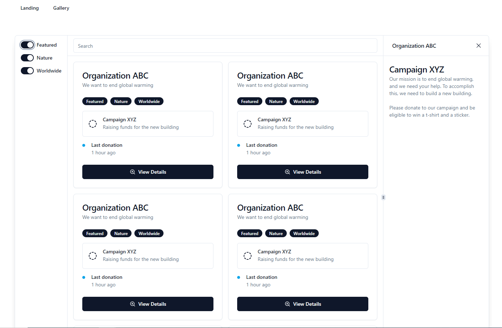

# Node-Express-Typescript
A weekend project for a donation site with multiple Organizations and Campaigns.

Tech stack is:
- Plain react as frontend (CRA)
- NodeJS + ExpressJS as backend
- Shadcn for UI components / Design system
- PostgreSQL as database
- Drizzle as database ORM
- Bonus: Stripe as Payment processor

## Steps to use Typescript With Node + Execute the project

## Data Models
- Organizations
  - name
  - description
  - tags

- Tags
  - label
  - name

- Campaigns
  - organization
  - name
  - description
  - goal

- Donation
  - campaign
  - amount